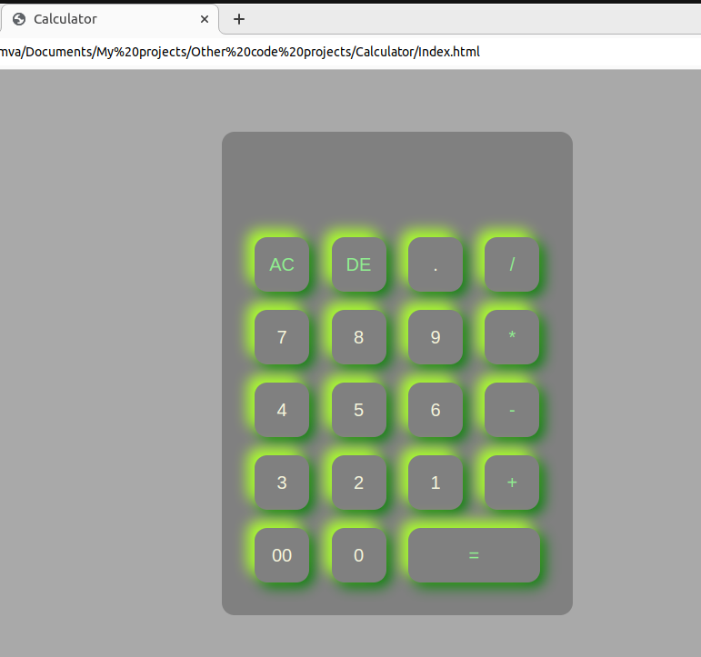
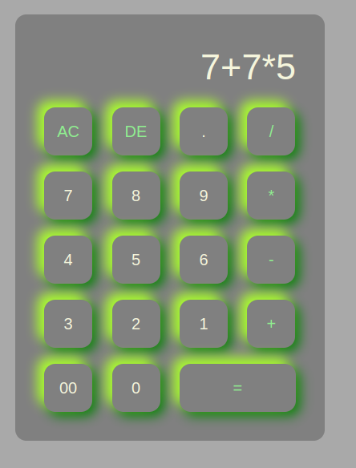
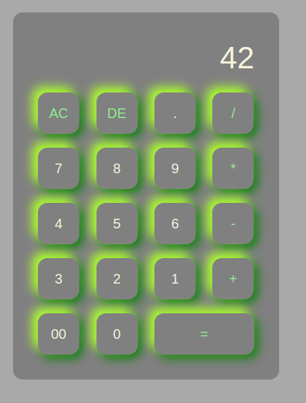

# Basic-Projects
Basic To Advance Journey

# Project 1
# 🧮 Basic Calculator

A simple and stylish web-based calculator built using **HTML, CSS, and JavaScript**. This project provides a smooth and interactive interface for basic arithmetic operations.


## 📸 Screenshots
| Initial Interface | Entering Expression | Displaying Result |
|------------------|--------------------|------------------|
|  |  |  |

## 🚀 How to Run
1. **Download or clone** this repository.
2. Open `Index.html` in your favorite web browser.

## 🛠️ Technologies Used
- **HTML** 🏗️ - Structure of the calculator.
- **CSS** 🎨 - Styling with a glowing effect.
- **JavaScript** ⚙️ - Functionality for calculations.

## 🏗️ Project Structure
```
📂 Calculator Project
 ├── 📄 Index.html   # Main HTML file
 ├── 🎨 Style.css    # Styling file
 ├── 📸 picture1.png # Screenshot of the UI
 ├── 📸 picture2.png # Screenshot of input
 ├── 📸 picture3.png # Screenshot of output
```

## 🎯 How It Works
- Click buttons to enter numbers and operators.
- The **equal (=) button** evaluates the entered expression.
- The **AC button** clears the entire input.
- The **DE button** deletes the last entered character.

## 📌 Future Enhancements
- ⏳ Implement keyboard support.
- 🎨 Add theme switcher (light/dark mode).
- 📱 Make it more mobile-friendly.

## 💡 Credits
Made with ❤️ by [Mehul Mridul].

Enjoy calculating! 🧮🚀


